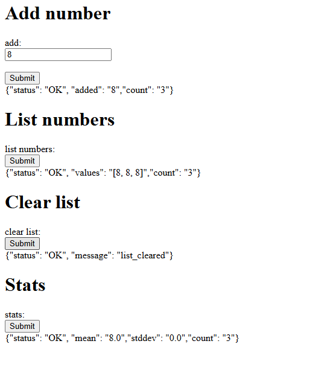

# Parcial Arep 1

## Autor Sebastian Cardona

## Intalar y ejecutar el proyecto

### Clonar el repositorio:

git clone https://github.com/SebastianCardona-P/Parcial1Arep

cd Parcial1Arep

### una vez dentro compilar:

mvn clean install

### Ejecute el HttpServer:
java -cp target/classes co.edu.escuelaing.parcial1corte.HttpServer

esto corre el backend en el puerto 35000

## Ejecute el Facade
en otra terminal

java -cp target/classes co.edu.escuelaing.parcial1corte.Facade

esto arrancará el server de facade en http://localhost:36000/

abra http://localhost:36000/ o http://localhost:36000/cliente para ver el cliente con HTML y JS

### empiece a probar

### Añadir un numero al linkedList 

### Listar los numeros

### limpiar la lista

### calcular las estadísticas

lista vacia:

Normal:

otro ejemplo
